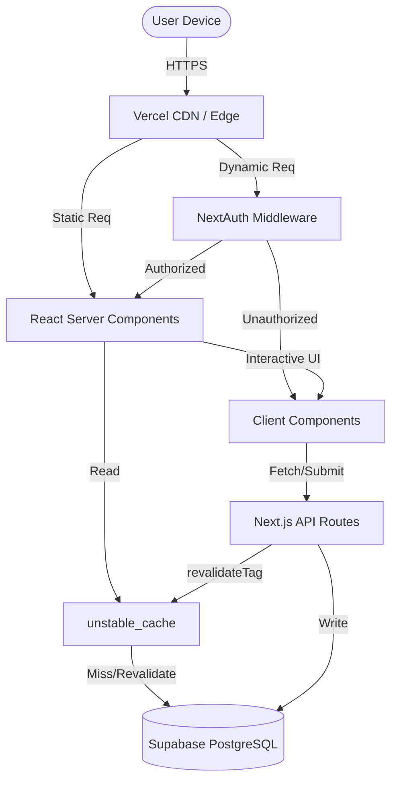

# System Architecture

CarbonTrack is built on Next.js 16 (App Router) utilizing React Server Components, Edge Middleware, and a Serverless PostgreSQL database.

## Design System

CarbonTrack features **two glassmorphic material systems**:

1. **Legacy Glass** (`liquid-glass` utilities in `globals.css`)
   - 2-3 merged layers with static gradients
   - Simple backdrop-filter approximation
   - Used throughout current codebase

2. **iOS 26 Liquid Glass V2** (`globals-liquid-glass.css`)
   - 6 isolated compositing layers
   - Physically-accurate refraction with SVG displacement
   - Cursor-tracked specular highlights (60fps)
   - Chromatic aberration fringing
   - See `LIQUID_GLASS_V2_SPEC.md` for complete technical documentation

Both systems coexist during transition. New components should use `<LiquidGlassV2>`. Full migration guide in `LIQUID_GLASS_INTEGRATION.md`.

## System Diagram

## Data Flow

1. **Anonymous Journey:**
   - The user visits the static landing page (`/`).
   - They navigate to the calculator (`/calculator`), interacting entirely via Client Components.
   - The calculation is performed synchronously via a pure function engine.
   - Results are rendered immediately and stored in `sessionStorage`.

2. **Authenticated Journey:**
   - User signs in via OAuth (GitHub/Google) processed by NextAuth.
   - Any anonymous `sessionStorage` draft is detected and automatically migrated to the database via `POST /api/footprint/calc`.
   - The user requests `/dashboard`.
   - React Server Components fetch historical data via `unstable_cache` preventing direct database load.
   - Recharts renders SVGs asynchronously to preserve the Core Web Vitals targets.

## Decision Log

### 1. Next.js App Router vs. Express
**Decision:** Next.js App Router
**Rationale:** Next.js provides native streaming, automatic static optimization, and integrated caching. An Express + React SPA would require manually maintaining a separate API deployment, managing data-fetching hydration states, and forfeiting Server Components which currently keep our bundle size drastically lower.

### 2. Supabase PostgreSQL vs. AWS RDS
**Decision:** Supabase PostgreSQL
**Rationale:** Supabase provides edge-compatible connection pooling (Supavisor) out of the box. Traditional RDS requires configuring a separate PgBouncer instance to prevent connection exhaustion from serverless functions. Supabase also enables a straightforward path to Row Level Security (RLS) in Phase 2.

### 3. Anonymous-First Architecture
**Decision:** Defer Database insertion until Authentication.
**Rationale:** Forms are the highest friction user experience. By allowing users to calculate and view their results entirely via client-side logic and `sessionStorage`, we drastically reduce the barrier to entry and rely on the value proposition (the results page) to drive signups.

## Scaling Considerations

### Current Limits
- **Compute:** Vercel Hobby/Pro tier limits Serverless Function execution to 10-60 seconds. Our calculation engine operates entirely synchronously in milliseconds, easily bypassing this limit.
- **Connections:** Supabase connection limits heavily bottleneck serverless applications.

### Horizontal Scaling Path
1. **Database:** As read volume grows, `unstable_cache` shields the DB. For heavy write volume, Supabase read replicas can be configured in the Prisma client (`datasources`).
2. **Compute:** The application is stateless (JWT sessions). Vercel edge nodes will automatically scale horizontally across regions.
